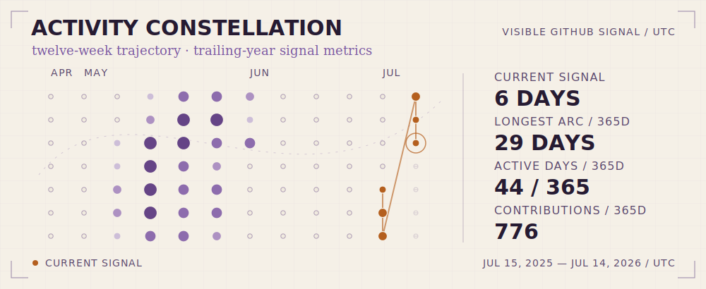
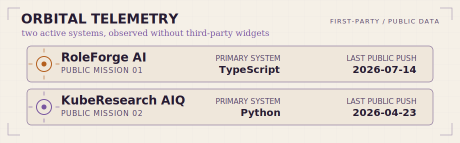

<picture>
  <source media="(prefers-color-scheme: dark)" srcset="./assets/hero-motion-dark.gif">
  <source media="(prefers-color-scheme: light)" srcset="./assets/hero-motion-light.gif">
  
</picture>

<h1 align="center">Ashmit Grover</h1>

  <strong>I build AI products and the cloud-native systems that carry them from idea to production.</strong> 
  Useful things, weird things, and the infrastructure that lets both survive contact with reality.

  <a href="https://agrover7.com/">Portfolio</a> ·
  <a href="https://www.linkedin.com/in/agrover7/">LinkedIn</a> ·
  <a href="https://github.com/agrovr">GitHub</a> ·
  <a href="https://agrover7.com/#contact">Open a transmission</a>

## Mission control

My work sits where product decisions meet system design: shaping an ambiguous workflow into an interface people can use, then building the APIs, agents, and cloud infrastructure that keep it dependable.

- **Product layer** — clear AI-assisted workflows with useful human checkpoints.
- **Intelligence layer** — agent orchestration, research flows, evaluation, and APIs.
- **Systems layer** — containerized services, Kubernetes delivery, monitoring, and production checks.

## Project constellations

### RoleForge AI · Trajectory engine

<picture>
  <source media="(prefers-color-scheme: dark)" srcset="./assets/roleforge-mission-dark.svg">
  <source media="(prefers-color-scheme: light)" srcset="./assets/roleforge-mission-light.svg">
  
</picture>

[RoleForge AI](https://github.com/agrovr/roleforge-ai) is an AI-assisted resume workflow that turns a source resume and target role into structured fit analysis, gap guidance, tailored documents, interview preparation, and exportable artifacts. Its public frontend is built with Next.js, React, and TypeScript, with authentication, saved projects, entitlement flows, theme support, and production smoke coverage.

**[Launch RoleForge AI](https://roleforgeai.vercel.app/) · [Explore the source](https://github.com/agrovr/roleforge-ai)**

<strong>Open mission telemetry</strong>

#### Flight plan

`resume upload → target role → fit and gap analysis → guided edits → application materials → export`

#### Systems aboard

- Next.js 16, React 19, and TypeScript
- Supabase authentication and saved projects
- Stripe-backed entitlement flows
- Light/dark themes and browser-level production smoke checks

### KubeResearch AIQ · Distributed research constellation

<picture>
  <source media="(prefers-color-scheme: dark)" srcset="./assets/kuberesearch-mission-dark.svg">
  <source media="(prefers-color-scheme: light)" srcset="./assets/kuberesearch-mission-light.svg">
  
</picture>

[KubeResearch AIQ](https://github.com/agrovr/kube-research-aiq) is a Kubernetes-native research-agent platform inspired by NVIDIA AI-Q. A FastAPI control plane coordinates queued workers and persistent state while a React dashboard exposes research runs. Helm, Argo CD, Prometheus, autoscaling, and network-policy resources make the architecture operable—not just diagrammable.

**[Explore the source](https://github.com/agrovr/kube-research-aiq)**

<strong>Open mission telemetry</strong>

#### Flight plan

`research query → FastAPI control plane → Redis queue → worker fleet → persisted report`

#### Systems aboard

- FastAPI, Redis, PostgreSQL, and a React dashboard
- Kubernetes, Helm, Argo CD, HPA, NetworkPolicy, and Prometheus
- Deterministic mock mode for local and repeatable runs
- Optional NVIDIA-hosted, NIM-compatible execution path

This is an independent project inspired by NVIDIA AI-Q; it is not affiliated with or endorsed by NVIDIA.

## Activity constellation

<a href="https://github.com/agrovr?tab=overview">
  <picture>
    <source media="(max-width: 600px) and (prefers-color-scheme: dark)" srcset="./assets/activity-orbit-mobile-dark.svg">
    <source media="(max-width: 600px) and (prefers-color-scheme: light)" srcset="./assets/activity-orbit-mobile-light.svg">
    <source media="(prefers-color-scheme: dark)" srcset="./assets/activity-orbit-dark.svg">
    <source media="(prefers-color-scheme: light)" srcset="./assets/activity-orbit-light.svg">
    
  </picture>
</a>

<!-- activity-summary:start -->
**Signal summary:** **776 publicly visible contributions** across **43 active days** in the last 365 days · **6-day current signal** · **29-day longest arc** · through **2026-07-14 UTC**.
<!-- activity-summary:end -->

<strong>Decode the activity signal</strong>

- Each star is one UTC day in the latest twelve-week flight path; size reflects GitHub's relative contribution level.
- Current signal, longest arc, active days, and contribution count use the trailing 365-day calendar visible to the repository workflow.
- A current signal may end yesterday so an unfinished UTC day does not break the streak.
- The atlas refreshes from GitHub's own GraphQL contribution calendar. It requests no private repository names and uses no streak service, visitor counter, or remotely hosted widget.
- The hero's slow acquisition loop is a repository-owned GIF, so GitHub's animated-image and reduced-motion preferences remain in control.

**[Open the native contribution log](https://github.com/agrovr?tab=overview)**

## Orbital telemetry

<picture>
  <source media="(prefers-color-scheme: dark)" srcset="./assets/orbital-telemetry-dark.svg">
  <source media="(prefers-color-scheme: light)" srcset="./assets/orbital-telemetry-light.svg">
  
</picture>

This first-party chart tracks the primary language and latest public push date of the two flagship repositories. It is generated in this repository from public GitHub data, with no visitor counter or external profile-widget service.

## Flight systems

- **AI product engineering** — turning model capabilities into understandable workflows, controls, and useful outputs.
- **Agents and APIs** — designing service boundaries, orchestration paths, queues, and persistent state around AI work.
- **Cloud-native delivery** — packaging applications with containers and operating them with Kubernetes-oriented tooling.
- **Production reliability** — treating authentication, entitlements, observability, smoke tests, and failure paths as product work.

## Early missions

- **[Resume Tailor Backend](https://github.com/agrovr/resume-tailor-backend)** — a standalone FastAPI service for job-description analysis, compatibility scoring, Gemini-assisted tailoring, DOCX generation, and Docker/Cloud Run deployment.
- **[CollegeProjects](https://github.com/agrovr/CollegeProjects)** — a C++ learning archive that includes a Key Management System and a Tamagotchi-style pet game.

## Open transmission

Want to compare notes, build something useful, or send an interesting problem into orbit? Visit [agrover7.com](https://agrover7.com/) or [open a transmission](https://agrover7.com/#contact).

signal from <a href="https://agrover7.com/">ash.</a> · all stars reserved ✦

