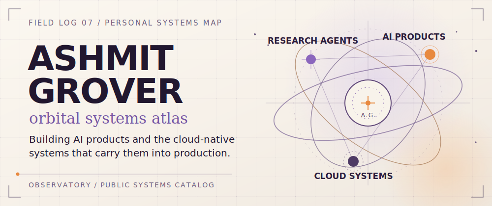
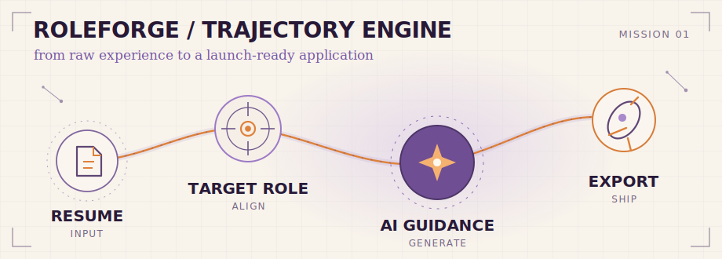
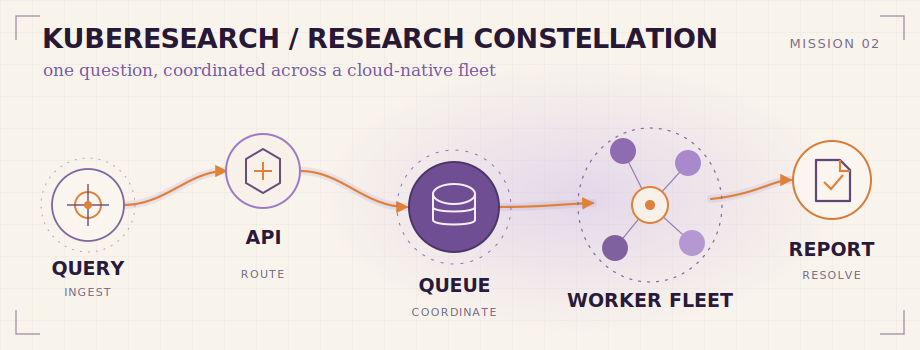

<a href="https://agrover7.com/">
<picture>
  <source media="(prefers-reduced-motion: reduce) and (prefers-color-scheme: dark)" srcset="./assets/hero-dark.svg">
  <source media="(prefers-reduced-motion: reduce) and (prefers-color-scheme: light)" srcset="./assets/hero-light.svg">
  <source type="image/webp" media="(max-width: 600px) and (prefers-color-scheme: dark)" srcset="./assets/hero-motion-mobile-dark.webp">
  <source type="image/webp" media="(max-width: 600px) and (prefers-color-scheme: light)" srcset="./assets/hero-motion-mobile-light.webp">
  <source type="image/webp" media="(prefers-color-scheme: dark)" srcset="./assets/hero-motion-dark.webp">
  <source type="image/webp" media="(prefers-color-scheme: light)" srcset="./assets/hero-motion-light.webp">
  <source media="(prefers-color-scheme: dark)" srcset="./assets/hero-dark.svg">
  <source media="(prefers-color-scheme: light)" srcset="./assets/hero-light.svg">
  
</picture>
</a>

<h1 align="center">Ashmit Grover</h1>

  <strong><a href="https://agrover7.com/">Enter the interactive atlas</a></strong> ·
  <a href="https://www.linkedin.com/in/agrover7/">LinkedIn</a> ·
  <a href="https://github.com/agrovr/agrovr/issues/new?template=transmission.yml">Open a GitHub transmission</a>

## Mission control

I turn ambiguous workflows into dependable AI products—designing the interface, intelligence layer, and cloud systems as one connected mission.

- **Product layer** — clear AI-assisted workflows with useful human checkpoints.
- **Intelligence layer** — agent orchestration, research flows, evaluation, and APIs.
- **Systems layer** — containerized services, Kubernetes delivery, monitoring, and production checks.

## Choose your orbit

Pick a route, then reveal its system map and flight plan.

### Maniflight · Repository preflight

[Maniflight](https://github.com/agrovr/maniflight) is a read-only repository preflight CLI and GitHub Action. It evaluates architecture, automation, security hygiene, and community readiness through 25 deterministic checks, then shows the evidence behind every result.

**[Explore the live self-scan →](https://agrovr.github.io/maniflight/)** · [Inspect the source](https://github.com/agrovr/maniflight)

<strong>Reveal the Maniflight readiness map</strong>

 

#### Flight plan

`repository → bounded evidence collection → deterministic rules → score + confidence → interactive report`

#### Systems aboard

- TypeScript and Node.js 22+
- 25 deterministic checks across four evidence domains
- Machine-readable JSON plus standalone HTML and SVG reports
- Read-only GitHub Action with keyboard navigation, light/dark themes, and reduced-motion support

### RoleForge AI · Trajectory engine

[RoleForge AI](https://github.com/agrovr/roleforge-ai) turns a source resume and target role into structured fit analysis, gap guidance, tailored documents, interview preparation, and exportable artifacts. Its public frontend includes authentication, saved projects, entitlement flows, theme support, and production smoke coverage.

**[Launch the product →](https://roleforgeai.vercel.app/)** · [Inspect the source](https://github.com/agrovr/roleforge-ai)

<strong>Reveal the RoleForge system map</strong>

 

<a href="https://roleforgeai.vercel.app/">
<picture>
  <source media="(prefers-color-scheme: dark)" srcset="./assets/roleforge-mission-dark.svg">
  <source media="(prefers-color-scheme: light)" srcset="./assets/roleforge-mission-light.svg">
  
</picture>
</a>

#### Flight plan

`resume upload → target role → fit and gap analysis → guided edits → application materials → export`

#### Systems aboard

- Next.js 16, React 19, and TypeScript
- Supabase authentication and saved projects
- Stripe-backed entitlement flows
- Light/dark themes and browser-level production smoke checks

### KubeResearch AIQ · Distributed research constellation

[KubeResearch AIQ](https://github.com/agrovr/kube-research-aiq) is a Kubernetes-native research-agent platform inspired by NVIDIA AI-Q. A FastAPI control plane coordinates queued workers and persistent state while a React dashboard exposes research runs. Helm, Argo CD, Prometheus, autoscaling, and network-policy resources make the architecture operable—not just diagrammable.

**[Explore the repository →](https://github.com/agrovr/kube-research-aiq)**

<strong>Reveal the KubeResearch system map</strong>

 

<a href="https://github.com/agrovr/kube-research-aiq">
<picture>
  <source media="(prefers-color-scheme: dark)" srcset="./assets/kuberesearch-mission-dark.svg">
  <source media="(prefers-color-scheme: light)" srcset="./assets/kuberesearch-mission-light.svg">
  
</picture>
</a>

#### Flight plan

`research query → FastAPI control plane → Redis queue → worker fleet → persisted report`

#### Systems aboard

- FastAPI, Redis, PostgreSQL, and a React dashboard
- Kubernetes, Helm, Argo CD, HPA, NetworkPolicy, and Prometheus
- Deterministic mock mode for local and repeatable runs
- Optional NVIDIA-hosted, NIM-compatible execution path

This is an independent project inspired by NVIDIA AI-Q; it is not affiliated with or endorsed by NVIDIA.

## Open a transmission

Ask a question, leave useful feedback, or explore collaboration through a structured GitHub form. The conversation continues in a real public thread, so it is easy to follow up.

**[Start a GitHub transmission →](https://github.com/agrovr/agrovr/issues/new?template=transmission.yml)** · [Use the private contact channel](https://agrover7.com/#contact)

GitHub transmissions are public. Do not include private, sensitive, or secret information.

## Public mission status

Selected public systems, refreshed daily from GitHub without an external profile widget.

<!-- transmission-summary:start -->
| Mission | Primary language | Last public push |
| :-- | :-- | --: |
| [Maniflight](https://github.com/agrovr/maniflight) | TypeScript | `2026-07-15` |
| [RoleForge AI](https://github.com/agrovr/roleforge-ai) | TypeScript | `2026-07-19` |
| [KubeResearch AIQ](https://github.com/agrovr/kube-research-aiq) | Python | `2026-04-23` |
<!-- transmission-summary:end -->

## Mission archive

<strong>Open earlier missions</strong>

- **[Resume Tailor Backend](https://github.com/agrovr/resume-tailor-backend)** — a standalone FastAPI service for job-description analysis, compatibility scoring, Gemini-assisted tailoring, DOCX generation, and Docker/Cloud Run deployment.
- **[CollegeProjects](https://github.com/agrovr/CollegeProjects)** — a C++ learning archive that includes a Key Management System and a Tamagotchi-style pet game.

## Ground station

Run the full interactive constellation at [agrover7.com](https://agrover7.com/) or connect on [LinkedIn](https://www.linkedin.com/in/agrover7/).

signal from <a href="https://agrover7.com/">ash.</a> · all stars reserved ✦

