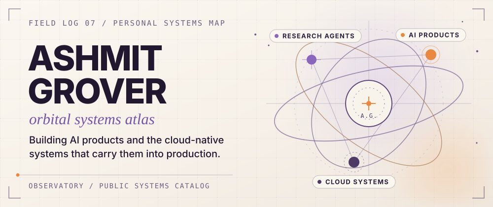
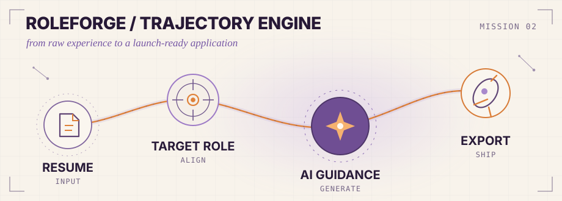
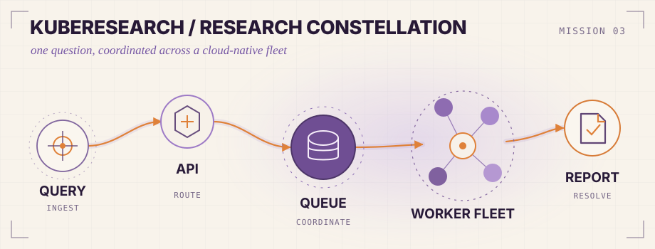

<a href="https://agrover7.com/">
<picture>
  <source media="(prefers-reduced-motion: reduce) and (prefers-color-scheme: dark)" srcset="./assets/hero-dark.svg">
  <source media="(prefers-reduced-motion: reduce) and (prefers-color-scheme: light)" srcset="./assets/hero-light.svg">
  <source type="image/webp" media="(max-width: 600px) and (prefers-color-scheme: dark)" srcset="./assets/hero-motion-mobile-dark.webp">
  <source type="image/webp" media="(max-width: 600px) and (prefers-color-scheme: light)" srcset="./assets/hero-motion-mobile-light.webp">
  <source type="image/webp" media="(prefers-color-scheme: dark)" srcset="./assets/hero-motion-dark.webp">
  <source type="image/webp" media="(prefers-color-scheme: light)" srcset="./assets/hero-motion-light.webp">
  <source media="(prefers-color-scheme: dark)" srcset="./assets/hero-dark.svg">
  <source media="(prefers-color-scheme: light)" srcset="./assets/hero-light.svg">
  
</picture>
</a>

<h1 align="center">Ashmit Grover</h1>

  <strong><a href="https://agrover7.com/">Interactive portfolio</a></strong> ·
  <a href="https://www.linkedin.com/in/agrover7/">LinkedIn</a> ·
  <a href="https://github.com/agrovr/agrovr/issues/new?template=transmission.yml">Ask me something</a>

## Mission control

I turn ambiguous workflows into dependable AI products, designing the interface, the intelligence layer, and the cloud systems as one connected mission.

| Product layer | Intelligence layer | Systems layer |
| :-- | :-- | :-- |
| AI-assisted workflows with clear human checkpoints | Agent orchestration, research flows, evaluation, and APIs | Containerized services, Kubernetes delivery, monitoring, and production checks |

## Choose your orbit

Three flagship systems, each shown as the path a request takes through it.

### Maniflight · PR Flight Director

A read-only GitHub CLI that explains **why a pull request is blocked**, separates observed blockers from missing evidence, and names **who can act next**. It never comments, approves, reruns, or merges.

<a href="https://github.com/agrovr/maniflight">
<picture>
  <source media="(prefers-color-scheme: dark)" srcset="./assets/maniflight-mission-dark.svg">
  <source media="(prefers-color-scheme: light)" srcset="./assets/maniflight-mission-light.svg">
  
</picture>
</a>

**[Install v1.0.0 →](https://github.com/agrovr/maniflight/releases/tag/v1.0.0)** · [Live self-scan](https://agrovr.github.io/maniflight/) · [Source](https://github.com/agrovr/maniflight)

<strong>Reveal the Maniflight systems aboard</strong>

 

`pull request → read-only GitHub evidence → blockers + unknowns → next actor → terminal or JSON`

- TypeScript on Node.js 22.12+ and Node.js 24
- Combines PR metadata, reviews, checks, statuses, Actions runs, and active branch rules
- Stable, schema-versioned terminal and JSON diagnostics
- Repository scan remains available as a secondary GitHub Action with accessible HTML and SVG reports

### RoleForge AI · Trajectory engine

Turns a resume and a target role into **fit analysis, gap guidance, tailored documents, and interview prep**, with auth, saved projects, and paid entitlements in production.

<a href="https://roleforgeai.vercel.app/">
<picture>
  <source media="(prefers-color-scheme: dark)" srcset="./assets/roleforge-mission-dark.svg">
  <source media="(prefers-color-scheme: light)" srcset="./assets/roleforge-mission-light.svg">
  
</picture>
</a>

**[Launch the product →](https://roleforgeai.vercel.app/)** · [Source](https://github.com/agrovr/roleforge-ai)

<strong>Reveal the RoleForge systems aboard</strong>

 

`resume upload → target role → fit and gap analysis → guided edits → application materials → export`

- Next.js 16, React 19, and TypeScript
- Supabase authentication and saved projects
- Stripe-backed entitlement flows
- Light/dark themes and browser-level production smoke checks

### KubeResearch AIQ · Distributed research constellation

A **Kubernetes-native research-agent platform**: a FastAPI control plane fans questions out to queued workers, with Helm, Argo CD, autoscaling, and Prometheus making it operable, not just diagrammable.

<a href="https://github.com/agrovr/kube-research-aiq">
<picture>
  <source media="(prefers-color-scheme: dark)" srcset="./assets/kuberesearch-mission-dark.svg">
  <source media="(prefers-color-scheme: light)" srcset="./assets/kuberesearch-mission-light.svg">
  
</picture>
</a>

**[Explore the repository →](https://github.com/agrovr/kube-research-aiq)**

<strong>Reveal the KubeResearch systems aboard</strong>

 

`research query → FastAPI control plane → Redis queue → worker fleet → persisted report`

- FastAPI, Redis, PostgreSQL, and a React dashboard
- Kubernetes, Helm, Argo CD, HPA, NetworkPolicy, and Prometheus
- Deterministic mock mode for local and repeatable runs
- Optional NVIDIA-hosted, NIM-compatible execution path

Independent project inspired by NVIDIA AI-Q; not affiliated with or endorsed by NVIDIA.

## Open a transmission

Questions, feedback, or a collaboration idea? Send it through a short GitHub form, and the conversation continues in a public thread that's easy to follow up on.

**[Ask a question →](https://github.com/agrovr/agrovr/issues/new?template=transmission.yml)** · [Contact me privately](https://agrover7.com/#contact)

GitHub transmissions are public. Do not include private, sensitive, or secret information.

## Public mission status

Refreshed daily from GitHub, with no third-party widgets.

<!-- transmission-summary:start -->
| Mission | Primary language | Last public push |
| :-- | :-- | --: |
| [Maniflight](https://github.com/agrovr/maniflight) | TypeScript | `2026-09-29` |
| [RoleForge AI](https://github.com/agrovr/roleforge-ai) | TypeScript | `2026-07-27` |
| [KubeResearch AIQ](https://github.com/agrovr/kube-research-aiq) | Python | `2026-04-23` |
<!-- transmission-summary:end -->

<strong>Mission archive</strong>: earlier projects

 

- **[Resume Tailor Backend](https://github.com/agrovr/resume-tailor-backend)**: a standalone FastAPI service for job-description analysis, compatibility scoring, Gemini-assisted tailoring, DOCX generation, and Docker/Cloud Run deployment.
- **[CollegeProjects](https://github.com/agrovr/CollegeProjects)**: a C++ learning archive that includes a Key Management System and a Tamagotchi-style pet game.

 

signal from <a href="https://agrover7.com/">ash.</a> · all stars reserved ✦

